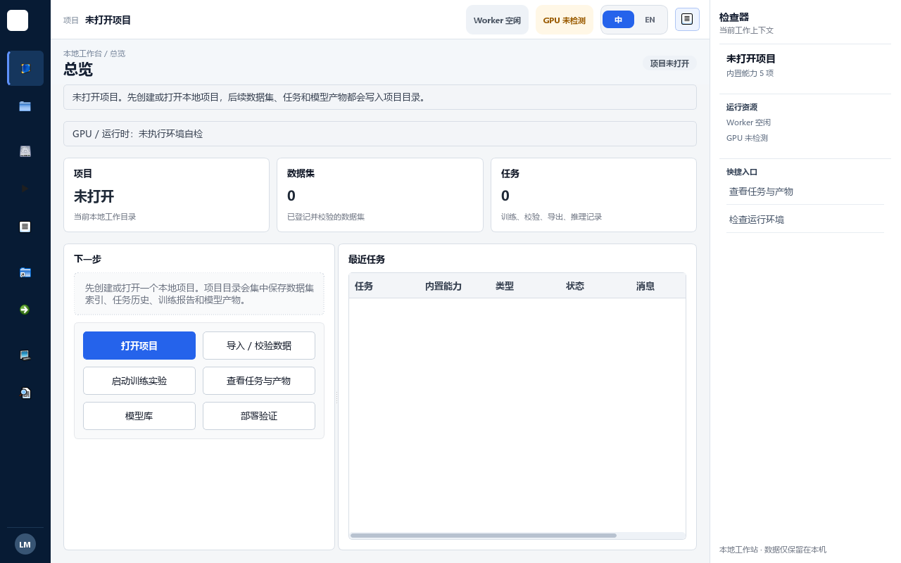
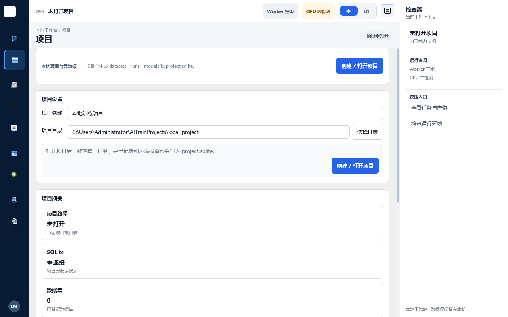
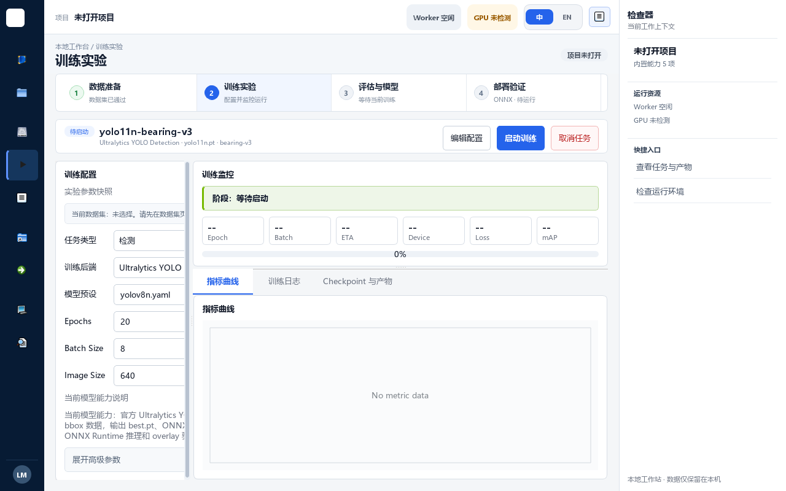
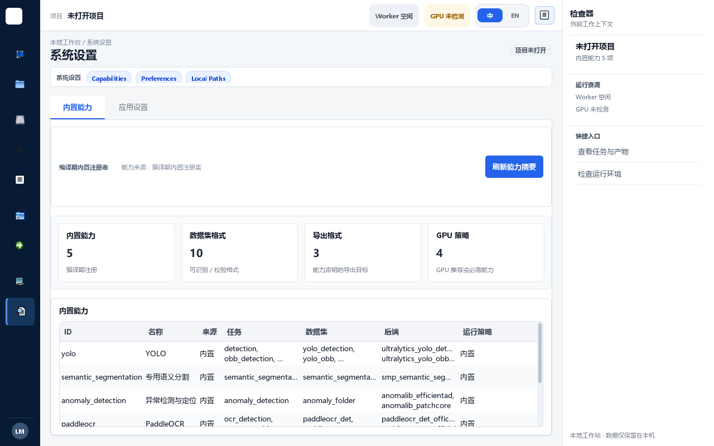

# AITrain Studio 全界面布局审查

## 审查范围

- 产品：`build-release/bin/AITrainStudio.exe`
- 视口：1280 × 800；修正前检查器默认展开，修正后按响应式规则默认折叠，并复核了手动展开状态。
- 页面：9 个一级工作区、21 个一级页与嵌套页签状态。
- 模式：UX 与可访问性联合审查。
- 说明：本文保留修正前问题作为审计轨迹，并在下方记录修正后验收结果。

## 总体结论

整体框架已经统一，但各业务页面仍沿用不同的固定宽度和旧式表单组织方式。最大的问题不是配色，而是 **1280px 下检查器占用 272px 后，主工作区仍按宽屏布局排版**，导致文字逐字换行、按钮被截断、表格列消失和多层滚动。

- P0：0 项
- P1：4 组——数据集复核布局、任务详情裁切、部署参数可读性、1280px 检查器响应式策略。
- P2：7 组——总览空白与横向滚动、项目重复操作、训练配置裁切、模型库操作冗余、交付证据密度、系统能力页空白、跨页语言与图标一致性。

## 修正后验收

修正后使用 Windows 平台真实字体渲染，在 1280 × 800 下重新截图检查 9 个一级工作区及部署高级参数展开态。未发现剩余 P0–P2 布局问题。

- 1280–1365px：导航收为 72px 图标栏；检查器默认折叠，用户仍可手动展开。
- 数据集复核：左侧固定为紧凑筛选区，操作按钮改为 2 × 2，说明文字不再逐字换行。
- 任务与产物：列表与详情最小宽度下调，检查器折叠和手动展开两种状态均不再静默裁切。
- 部署验证：高级导出参数默认折叠，字段使用完整标签和纵向表单；展开后通过独立纵向滚动完整访问。
- 总览、项目、模型库、系统设置：清除空表横向滚动、重复主操作和异常拉伸空白。
- 训练实验：配置栏扩大并允许内容收缩、换行和纵向滚动，中央监控仍保持主要宽度。

修正后截图：

- [总览](post-fix/01-overview-windows.png)
- [项目](post-fix/02-project-windows.png)
- [数据集复核](post-fix/03-dataset-review-windows.png)
- [训练实验](post-fix/04-training-windows.png)
- [任务与产物](post-fix/05-tasks-windows.png)
- [模型库](post-fix/06-models-windows.png)
- [部署导出](post-fix/07-deployment-export-windows.png)
- [部署高级参数展开](post-fix/07-deployment-advanced-windows.png)
- [环境](post-fix/08-environment-windows.png)
- [系统设置](post-fix/09-settings-windows.png)

修正后结果：`passed`

## 修正前逐页审查

### 1. 总览——需修正

- 优点：项目、数据集、任务三项状态和下一步入口清晰。
- 问题：最近任务为空时仍出现横向滚动条；左右面板被强制拉满高度，形成大块无意义空白；空状态没有利用空间解释推荐工作流。
- 建议：状态卡与下一步保持内容高度，最近任务占据剩余区域；空表使用居中空状态，移除空数据横向滚动。

### 2. 项目——需修正

- 优点：路径、SQLite、数据集等项目状态分组明确。
- 问题：“创建 / 打开项目”同时出现在顶部和表单底部；摘要卡纵向堆叠，首屏只能看到一部分摘要并产生不必要滚动；缺少项目列表与当前项目的主次区分。
- 建议：保留一个主操作；采用“项目列表 / 项目详情”双栏或摘要横排，并把目录结构放入次级页签。

### 3. 数据集——存在 P1 布局缺陷

- 数据集准备将校验、划分、快照、质量报告、问题清单、修复和格式转换同时堆在一个长表单里；首屏看不到数据集库、样本预览和校验结果。
- 顶部英文能力标签看起来像页签，但实际不承担导航，增加了层级噪声。
- 建议：首层改为数据集库与当前数据集详情；导入/转换使用弹窗或抽屉，校验结果、类别分布和样本预览作为详情页签。

- P1：复核状态说明被挤成单字竖排，按钮组与说明区域争抢宽度。
- P1：右侧复核队列表头占据有限宽度，左侧筛选区又存在大面积空白，比例失衡。
- 建议：左侧固定 280–320px 筛选栏，状态说明改为横向状态条；右侧队列占剩余宽度，空状态放在表格中央。

### 4. 训练实验——基本健康

- 优点：四步流程、运行头、配置/监控/检查器三栏关系清楚，是当前最接近 HTML 基准的页面。
- P2：220px 配置栏不足以容纳标签、输入框和后端说明，数据集摘要及能力说明被裁切；内部滚动条紧贴分隔线。
- P2：空闲状态仍显示六个无内容指标框，信息密度偏高。
- 建议：默认配置栏改为只读摘要，点击“编辑配置”再打开宽抽屉；空闲状态保留 3–4 个关键指标。

嵌套页签均可切换：

- [训练日志](screenshots/05-training-2.png)
- [Checkpoint 与产物](screenshots/05-training-3.png)

### 5. 任务与产物——存在 P1 布局缺陷

- P1：检查器展开时，右侧任务详情的第四列操作、表格尾部列和部分按钮被工作区边界直接截断。
- P1：筛选区的搜索框、任务列表和详情面板都使用固定最小宽度，页面只能依赖内部滚动，用户无法判断右侧还有内容。
- 复核结果：折叠检查器后布局恢复正常，说明根因是响应式策略而非内容本身。
- 建议：1280–1365px 默认将检查器改为覆盖式抽屉或自动折叠；任务列表固定 34% 左右，详情区自适应；操作按钮允许两行重排。

详情页签：

- [指标](screenshots/06-tasks-2.png)
- [导出](screenshots/06-tasks-3.png)
- [预览](screenshots/06-tasks-4.png)

### 6. 模型库——可用但操作冗余

- 优点：四个详情页签清晰，空表格没有严重裁切。
- P2：顶部“刷新模型库”和下方蓝色“刷新模型库”重复；七个同权重按钮占据近三分之一首屏，真正的模型表被压低。
- P2：中文导航与英文能力标签混用，标签也容易被误认为第二组页签。
- 建议：仅保留刷新和主操作；其余动作随模型选中后显示在详情栏或更多菜单中。

其他页签：

- [评估报告](screenshots/07-models-2.png)
- [模型对比](screenshots/07-models-3.png)
- [流水线记录](screenshots/07-models-4.png)

### 7. 部署验证——需修正

- P1：官方参数中的 `imgsz`、batch、device 等输入框被压缩成极小字段，标签截断后难以识别。
- 左侧同屏容纳模型、格式、参数、校准、输出、验证图片、说明和两个动作，阅读顺序过密。
- 建议：将导出配置改为两段式流程：模型与格式 → 高级参数与验证；高级参数默认折叠并使用完整标签。

- 推理链路四步表达清楚，主要操作可见。
- P2：输入框在窄列中持续省略文本；“可解析结果”区域被压到首屏下方；“Overlay 预览”语言不统一。

### 8. 环境——健康

- 四个状态卡、环境检查表和主操作层级合理，是除训练页外最稳定的页面。
- P2：空闲时九项检查使用相同重复文案，可以合并为统一空状态，减少视觉噪声。

- 双栏结构可用，主操作可见。
- P2：左侧证据表的说明列长期省略；右侧表单密度高且依赖内部滚动。建议选中证据后再显示对应表单，而不是固定展示全部 OCR 验收字段。

### 9. 系统设置——需修正

- P2：能力页顶部工具条被拉伸成约 140px 高的大空白区；能力表格关键字段大量省略。
- 建议：工具条恢复 40–48px 内容高度；能力详情使用行选择后的侧栏，不把全部长文本塞入表格列。

- 表单分组清楚，路径保存操作可见。
- P2：全局顶栏和应用设置页同时提供语言切换，且页面提示“保存后重启”与顶栏即时切换的心理模型不一致；系统入口需要滚动才能完整看到。

## 跨页面问题

1. **1280px 检查器策略错误**：检查器默认占用 272px，但业务页面没有真正重排。建议 1365px 以下默认折叠或使用覆盖式抽屉。
2. **固定宽度过多**：表单、按钮组、表格列和分栏同时设置最小宽度，导致内容被静默裁切。
3. **多层滚动**：页面滚动、面板滚动和表格滚动同时出现，滚轮焦点不明确。
4. **操作权重失控**：刷新、选择、打开、查看、对比等动作大量平铺成同等按钮，压低了核心内容。
5. **导航与语言不统一**：紧凑导航只剩平台原生图标，含义不够稳定；中文页面混用英文能力标签和标题。
6. **空状态利用不足**：大量空表格和拉满高度面板没有解释下一步，也没有收缩到合理内容高度。

## 可访问性风险

- 8pt 左右的辅助文字偏小，浅灰文字在低质量显示器上存在对比度风险。
- 紧凑导航只显示图标，工具提示只能帮助鼠标用户；仍需验证键盘焦点、可访问名称和读屏顺序。
- 被裁切的按钮与表格列会让键盘用户和低视力用户无法发现隐藏内容。
- 本轮截图不能证明完整 WCAG 符合性；尚未验证读屏、200% 缩放、高对比度模式和完整键盘路径。

## 建议修正顺序

1. 修正 1280px 检查器策略，并清除任务页静默裁切。
2. 重排数据集质量与复核页，解决单字竖排和按钮拥挤。
3. 重排部署导出参数，保证字段和标签完整可读。
4. 将训练配置改为摘要 + 编辑抽屉，消除左栏裁切。
5. 清理项目、模型库的重复主操作，以及系统能力页的大空白。
6. 最后统一图标、语言、空状态和辅助文字尺寸。
